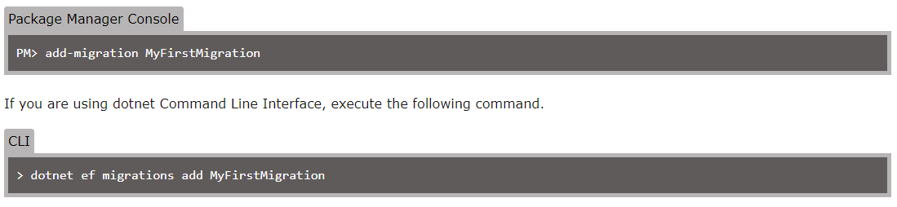

# NewStackDojo

> ## `Practice implement Entity Framework in Web API`
>
> ;
>
> 1. `DbContext` => จะเป็นส่วนของ Data Access ที่จัดเกี่ยวกับการเชื่อมต่อกับ Database
> 2. `Repository (Repo)` => จะทำหน้าที่เป็น service ที่เป็นตัวกลางในการจัดการข้อมูลระหว่าง `Controller` กับ `DbContext` จะทำหน้าที่ 2 อย่าง
>
> - `Repository` Read/Write `DbContext` เพื่อเข้าถึงข้อมูลบน Database เพื่อนำข้อมูลมาจัดการ process อะไรซักอย่างต่อ
> - `Controller` จะเข้ามา Read/Write Repository เพื่อเรียกใช้ process อะไรซักอย่างที่จัดการกับข้อมูลบน Database
>
> 3. `Controller` => จะเป็นตัวจัดการเกี่ยวกับ Endpoint ของ Api
> 4. `Data Object Transfer (DTO)` => เป็น model ที่ Client ต้องการจากฝั่ง Server จริงๆ เพราะในชีวิตจริง Client ไม่ได้ต้องการข้อมูลทุก field (column) บน Table ต้องการจะเฉพาะบาง field เท่านั้น\
>    `Note : ` ใช้ library พวก mapster,automapper ในการ mapping

> ## **`Entity Framework (EF)`**
>
> เป็น Library ที่จะทำให้เราเขียน code ในการจัดการกับ Relational Database ง่ายขึ้น
>
> ### **`Entity Framework Architecture`**
>
> 
>
> 1. `EDM (Entity Data Model)`=> layer นี้เป็น in-memory ของ metadata ทั้งหมด จะประกอบไปด้วย 3 ส่วน
>
>    - Conceptual Model
>    - Mapping
>    - Storage Model
>
> 2. `LINQ to Entities(L2E)` => layer นี้เป็นส่วนที่จัดการแปลง LINQ Query ให้เป็น SQL Query
> 3. `Entity SQL` => ก็เหมือนกับ `L2E` แต่จะยากกว่า (ต้องไปศึกษาเพิ่ม)
> 4. `Object Service` => layer นี้เป็น main entry point ที่จะเข้าถึงข้อมูลจาก database และ return ข้อมูลกลับ มันจะทำหน้าที่ในการแปลงข้อมูลที่ได้จาก `Entity Client Data Provider` ให้เป็น Entity Object
> 5. `Entity Client Data Provider` => layer นี้เป็นส่วนที่จัดการแปลง `LINQ to Entities(L2E)` หรือ `Entity SQL` ให้เป็น `SQL query language` ที่ Relational Database เข้าใจ ซึ่งมันจะทำงานร่วมกับ `ADO.Net data provider` ในการส่งหรือรับข้อมูลจาก Database
> 6. `ADO.Net Data Provider` => เป็น layer ที่ใช้ติดต่อกับ Database โดยใช้ `standard ADO.Net`
>
> ### **`How Entity Framework Works?`**
>
> 
>
> #### **_ความสามารถของ Entity Framework API_**
>
> 1. map entity class กับ database schema
> 2. translate, execute LINQ query to SQL query (https://www.entityframeworktutorial.net/querying-entity-graph-in-entity-framework.aspx) \
>    `Note : ` EF ยังสามารถใช้ SQL statement ได้อีกด้วย (https://www.entityframeworktutorial.net/EntityFramework4.3/raw-sql-query-in-entity-framework.aspx)
> 3. keep track change ,save change to database
>
> #### **_Entity Data Model(EDM)_**
>
> => เป็น in-memory ของ metadata ทั้งหมด
> จะประกอบไปด้วย 3 ส่วน
>
> 
>
> 1. `Conceptual Model` => EF จะสร้างขึ้นจาก Entity class,Context class
> 2. `Storage Model` => EF จะสร้างขึ้นจาก database schema
> 3. `mapping` => EF จะ mapping Conceptual Model กับ Storage Model
>
> `Note : ` EF จะจัดการ CRUD operation โดยใช้ `EDM` ในการสร้าง SQL query จาก LINQ query และ สร้าง INSERT,UPDATE,DELETE commands และแปลง result ที่ได้จาก database ให้เป็น Entity Object
>
> #### **_Querying_**
>
> EF Api จะแปลง LINQ-to-entities ให้เป็น SQL query แล้ว execute ไปที่ database โดยใช้ EDM และแปลง result ที่ได้กลับมาเป็น Entity Object
> 
>
> #### **_Saving_**
>
> เมื่อมีการ INSERT,UPDATE,DELETE เราจะ keep track change, save change to database โดยใช้ SaveChanges()
> 
>
> ### **`Context Class in Entity Framework`**
>
> => เป็น class ที่มีความสำคัญมากกับ EF ที่ใช้ในการทำ CRUD operations \
> => Context class เป็น class ที่ inherit DbContext \
> => DbContext จะใช้จัดการเกี่ยวกับ
>
> - database connection
> - configure model & relationship
> - query ข้อมูลจาก Database
> - save ข้อมูลลงบน Database
> - configure change tracking
> - caching
> - transaction
>
>   
>
> จากตัวอย่าง Context Class
>
> - จะมี Entity `DbSet<EntityClass>` ของแต่ละ Table เป็น property ของ Context Class
> - เราสามารถ overide `OnConfiguring()` เพื่อสร้าง connection กับ Database (`สามารถไป configure ที่ startup.cs ได้`)
> - เราสามารถ overide `OnModelCreating()` เพื่อ configure model
>
> ### **`Entity Class in Entity Framework`**
>
> คือ class model ที่เอาไว้ map กับ Table database
>
> - ถูกใช้เป็น type ของ DbSet ใน `Context Class`
> - EF Api มันจะ map Entity กับ Table database ด้วย property ของ Entity class กับ column ของ Table database
> - `DbSet <Entity Class>` หลายๆตัวเราเรียกทั้งหมดว่า EntitySet ซึ่งเราเรียกแต่ละตัวว่า Entity
>
> Entity class มี property 2 แบบ
>
> 1. `Scalar property` => property ที่เป็น primitive type (`string,int,bool,DateTime,byte,double etc.`)
> 2. `Navigation property` => มี 2 แบบ
>    - Reference => เป็น property ที่ ref ถึง Entity class อื่น
>    - Collection => เป็น property ที่เป็น collection และมี type collection ref ถึง Entity class อื่น
>
> ### **`Basic Workflow in Entity Framework`**
>
> 
>
> 1.  สร้าง model ที่ประกอบไปด้วย Entity(`Domain`) class(`model ของ table หรือเรียกอีกชื่อ Entity Class`), Context class(`จัดการเกี่ยวกับการเชื่อมต่อกับ database`) สืบทอด DbContext, Configuration \
>     `Note : ` EF จะจัดการ CRUD operation ผ่าน model ที่เราสร้างขึ้น
> 2.  insert คือ add Entity(`Domain`) object(`model ของ table`) ไปที่ Context และ SaveChanges() ทุกครั้ง เพื่อเป็นการ execute insert ขึ้นไปที่ database
> 3.  การดึง data จัดการผ่าน LINQ-to-Entities โดยจะแปลง query นี้ให้เป็น SQL query และ execute ได้ result กลับมาแปลงเป็น Entity(`Domain`) object(`model ของ table`)
> 4.  update, delete คือ update หรือ remove Entity object จาก context และ SaveChanges() ทุกครั้ง เพื่อเป็นการ execute update, delete ขึ้นไปที่ database
>
> ### **`Migration`**
>
> เป็นวิธีที่ทำให้ database schema sync กับ EF core model
>
> 
>
> - จากรูป EF Core Api จะสร้าง EF Core Model จาก Entity(Domain) class
> - EF Core Migration จะ Create หรือ Update database schema ผ่าน EF Core Model
> - เมื่อ Entity(Domain) class มีการเปลี่ยนแปลง เราต้อง run migration ทุกครั้งเพื่อ `update database schema` ให้ตรงกับ `Entity class` ที่เราเปลี่ยนแปลง
>
> EF Core Migration Command มีดังนี้
> 
>
> 1. **Adding a Migration**
>
> 
>
> - ตอนเริ่มเรายังไม่มี database เราต้องสร้าง Entity(Domain) class
> - สร้าง Migration สำหรับการ create, update database schema(`เอาไว้สำหรับ sync กับ EF Core Model`)
> - เมื่อเราสร้าง Migration จะได้ Folder ของการ Migration มามี 3 ไฟล์
>   - < timestamp>\_< Migration Name>.cs -> เป็นไฟล์หลักของ migration จะมี migration operation Up(), Down()
>     - Up() -> จะมี code ที่จัดการเกี่ยวกับ create database object
>     - Down() -> จะมี code ที่จัดการเกี่ยวกับ remove database object
>   - < timestamp>\_< Migration Name>.Designer.cs -> เป็นไฟล์ migration metadata ที่จะมีข้อมูลที่ใช้กับ EF Core
>   - < contextclassname>ModelSnapshot.cs -> เป็น `snapshot model` ใช้กำหนดการเปลี่ยนแปลง เมื่อมีการ create next migration
> - หลังจากเราสร้าง Migration เสร็จ ขั้นตอนต่อไปคือ create database
>
> 2. **Creating or Updating the Database**
>
> 
>
> - Updatate command จะสร้าง database,table จาก context class,entity class,migration snapshot (`ที่ถูกสร้างจาก add command`)
> - ถ้าเป็นการ migration ครั้งแรกมันจะสร้าง Table ให้ตาม EntitySet ที่อยู่ใน Context class แต่ถ้าไม่ใช่ครั้งแรกมันจะไป update database schema ให้แทน
>
> 3. **Removing a Migration**
>
> 
>
> - เราสามารถ remove last migration ที่เราไม่ใช้ โดย remove command จะไป remove last created migration, revert snapshot model กลับไปเป็นของ migration ก่อนหน้า
>
> ### `Summary`
>
> - จะสร้าง layer ที่ทำหน้าที่เป็น Database Model เป็น class ใน project
> - Entity Framework จะ mapping class (`Database Model`) กับ Table,View,Store Procedure บน Database มาไว้ที่ project
> - ทำให้เวลาจะ query ไม่ต้องเขียน SQL statement แล้วส่งไป execute ต่อที่ Table อีก
> - Entity Framework จะจัดการให้เราทุกอย่างเกี่ยวกับการเชื่อมต่อกับ Database ไม่ว่าจะเป็นพวกคำสั่ง DataSet, DataTable, DataReader, ExecuteNonQuery เราสามารถเรียกใช้งาน Table ได้เลยผ่าน EntitySet ที่มันสร้างขึ้น
> - ใช้ LINQ ในการ query แทนการเขียน SQL statement(`ใช้งานกับ Entity Framework`)
>
> ## **`ADO.NET`**
>
> เป็น Library ที่จัดการการติดต่อระหว่าง Application กับ Database
>
> - สร้าง connection การเชื่อมต่อกับ sql server
> - เปิดการเชื่อมต่อ
> - สร้าง SQL statement
> - ส่ง SQL statement ไป execute ต่อที่ Table
> - ปิดการเชื่อมต่อ

> ## `Transaction`
>
> transaction เป็น unit of work ของข้อมูลที่เปลี่ยนแปลงบน database
>
> - ถ้า transaction success => ทุก data operation จะโดน commit และ save ทุกการเปลี่ยนแปลงลง database
> - ถ้า transaction error/fail => ทุก data operation จะโดน cancle,rollback ทุกๆ data ที่มีการเปลี่ยนแปลงจะถูก remove
>
> `EX.` มีการแลกเปลี่ยนเงินระหว่าง Account1,Account2 จะมี 2 process เกิดขึ้น
>
> - ถอนเงินจาก Account1
> - แล้วนำมาฝากเข้า Account2\
>   ถ้าทั้ง 2 process success ก็จะไม่มีปัญหาอะไร แต่ถ้าสมมติ process แรก success แต่ process ที่ 2 fail เงินมันถูกถอนออกจาก Account1 แล้วแต่ยังไม่ถูกฝากเข้า Account2 นี่เป็นตัวอย่างปัญหาที่เกิดขึ้น เราจึงใช้ transaction มาจัดการปัญหาพวกนี้
>
> `How To :`
>
> - https://www.c-sharpcorner.com/article/transaction-in-net/

> ## `Microsoft SQL Server`
>
> คือ service SQL server ของ Microsoft ที่เอาไว้จัดการเกี่ยวกับ database
>
> ### **ข้อจำกัด**
>
> - สร้าง database ได้มากสุดคือ 32,767
>
> ### **ข้อกำหนดเบื้องต้น**
>
> - Create database statement มันจะ autocommit เป็น default และจะไม่อนุญาติ explicit หรือ implicit transaction
>
> ### **คำแนะนำ**
>
> - master database จะถูก back up ไว้เมื่อไรก็ตามที่มีการสร้าง,เปลี่ยนแปลง,ลบ
> - รองรับข้อมูลจำนวนมาก
>
> มี 4 แบบ
>
> 1. enterprise
> 2. standard
> 3. express
> 4. developer
>
> `Note : `
>
> - enterprise, standard สำหรับ production,มีค่าใช้จ่าย license, มี feature ให้ใช้เยอะ มีค่าใช้จ่ายสูง
> - express, developer เป็นแบบ free
> - express มีพื้นที่จัดเก็บจำกัด 10 GB (เพียงพอต่อการใช้งานกับ data ขนาดเล็ก)
> - developer มี feature ทุกอย่างเหมือน enterprise แต่ไม่สามารถใช้กับ production ได้

> ## `Reference `
>
> - https://www.c-sharpcorner.com/article/transaction-in-net/
> - https://www.entityframeworktutorial.net/what-is-entityframework.aspx
> - https://www.entityframeworktutorial.net/basics/basic-workflow-in-entity-framework.aspx
> - https://www.entityframeworktutorial.net/basics/how-entity-framework-works.aspx
> - https://www.entityframeworktutorial.net/EntityFramework-Architecture.aspx
> - https://www.entityframeworktutorial.net/basics/context-class-in-entity-framework.aspx
> - https://www.entityframeworktutorial.net/efcore/entity-framework-core-dbcontext.aspx
> - https://www.entityframeworktutorial.net/basics/entity-in-entityframework.aspx
> - https://www.entityframeworktutorial.net/efcore/entity-framework-core-console-application.aspx
> - https://www.thaicreate.com/tutorial/entity-framework-introduction.html
> - https://www.c-sharpcorner.com/UploadFile/201fc1/sql-server-database-connection-in-csharp-using-adonet/
> - https://www.entityframeworktutorial.net/querying-entity-graph-in-entity-framework.aspx
> - https://www.entityframeworktutorial.net/efcore/entity-framework-core-migration.aspx
